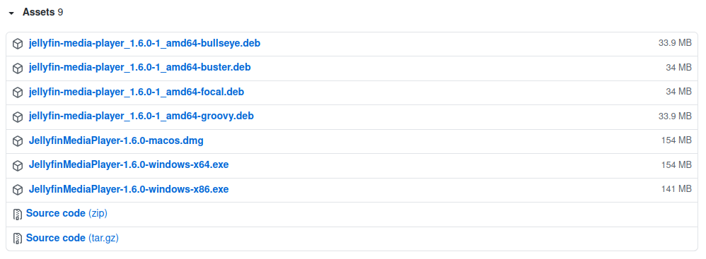
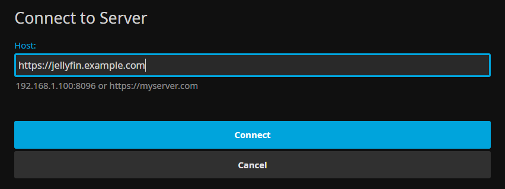

[Home](./)

# What is Jellyfin Media Player?

[Jellyfin Media Player](https://github.com/jellyfin/jellyfin-media-player#readme) is a desktop client for Jellyfin that supports a wide array of video, audio, and subtitle formats. It is based on mpv and is available for Windows, macOS, and Linux.

# Installing Jellyfin Media Player

1. [Click here](https://github.com/jellyfin/jellyfin-media-player/releases/latest) to go to the latest release of Jellyfin Media Player
2. Scroll down to the "Assets" section, shown in the screenshot below
    - You may have to click to open the Assets list
3. Download the appropriate installer for your system:
    - For Windows 64-bit, choose the file that ends with `windows-x64.exe`
    - For Windows 32-bit, choose the file that ends with `windows-x86.exe`
    - For masOS, download the one that ends with `macos.dmg`
4. Install Jellyfin Media Player from the file you downloaded

# Updating

To update Jellyfin Media Player, download the [latest version](https://github.com/jellyfin/jellyfin-media-player/releases/latest) and install it. This will upgrade your current installation to the newest version.

If you are experiencing issues updating, try uninstalling the version you currently have before installing the new version.

# Connecting to a Jellyfin Server

When you first open Jellyfin Media Player it will ask you to connect to a server. Enter the address of the Jellyfin server you want to connect to and press `Connect`.

Make sure to include the `https://` at the start of the address, e.g. `https://jellyfin.example.com`.

