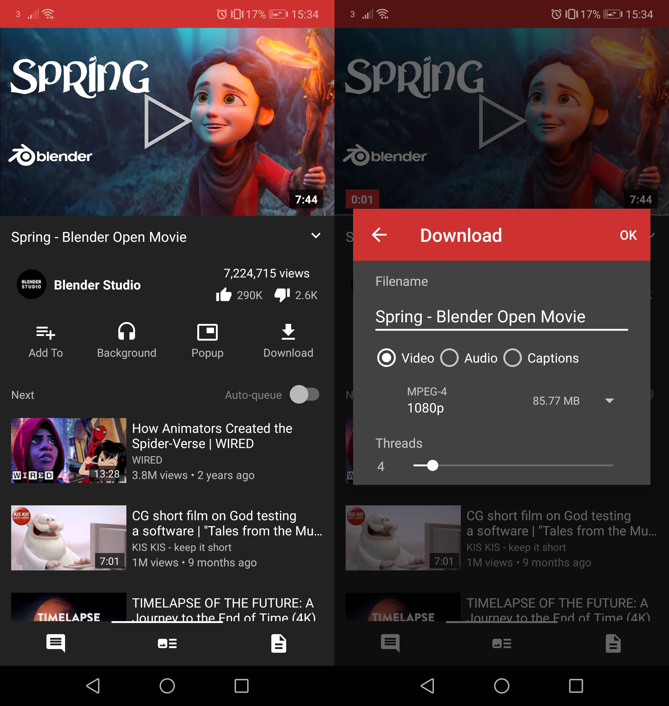

[Home](./)

# What is NewPipe?

[NewPipe](https://newpipe.net/) is a privacy-friendly Android app for watching videos and listening to music from sites like YouTube. Its features include:

- No adverts
- Download video and audio
- Play audio in the background while using other apps
- Subscriptions and playlists without an account
- Organise subscriptions into groups

# Installing F-Droid

In order to install NewPipe you must have the F-Droid app. Please follow [these instructions](./f-droid) if you do not already have it.

# Installing NewPipe

## From F-Droid

NewPipe can be [installed from F-Droid](./f-droid#installing-apps-from-f-droid) like other apps. [This link](https://f-droid.org/packages/org.schabi.newpipe/) should take you to the appropriate page in F-Droid.

## Using NewPipe's F-Droid Repository

NewPipe's F-Droid repository allows updates to NewPipe to be available sooner than on the default F-Droid repository. This is also useful if you are having issues with the default version of NewPipe. The [official instructions](https://newpipe.net/FAQ/tutorials/install-add-fdroid-repo/) explain how to do this.

# Links

[NewPipe Homepage](https://newpipe.net/)

[NewPipe Frequently Asked Questions](https://newpipe.net/FAQ/) (press `Show all`)

