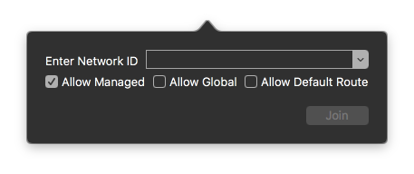
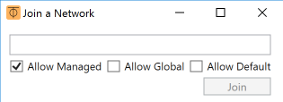
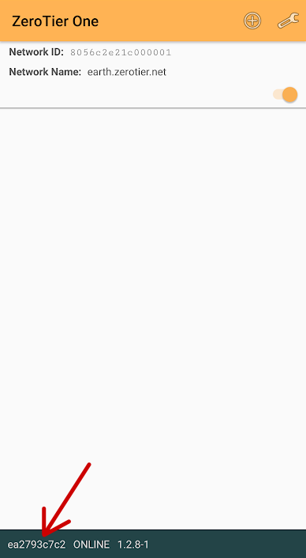

[Home](./)

# Installing ZeroTier One

ZeroTier One is the software you will use to connect to a ZeroTier network. Start by downloading and installing [ZeroTier One for your device](https://www.zerotier.com/download/).

# Joining a Network

## macOS or Windows

First, open the ZeroTier One interface:

 - On macOS, the app will be in the menu bar with the ⏁ icon. Click on it and select `Join Network`

- On Windows, the app is in the system tray in the bottom right. Right click it and select `Join Network`

Then, enter the Network ID and press `Join`

## Android or iOS

1. Press the + in the top corner of the main app screen
2. Enter the Network ID
3. Press `Add Network`
4. Make sure the switch next to the network name on the main screen is turned on

Your device may give you a message or notification about a VPN connection. This connection is needed to join the ZeroTier network.

# Getting Your Connection Accepted

Your network administrator may need to accept your connection to the network. Find out by asking them. If so, they will need your Node ID.

## Finding Your Node ID

### macOS or Windows

1. Open the ZeroTier menu
2. Your Node ID should be displayed
3. Make note of it

### Android or iOS

Find your Node ID in the status bar at the bottom of the main app screen, as shown below:

# Checking You're Connected and Reconnecting

## macOS or Windows

1. Open the ZeroTier menu to see all the networks you've added
2. If the network does not have a tick next to it, it's disconnected. Click on the network to join it

## Android or iOS

1. Open the main screen of the ZeroTier app
2. Make sure the switch next to the network name on the main screen is turned on
3. If you have successfully connected, the message in the status bar of the app should say "Online"

The screenshot above shows the app screen with a successfully connected network.

If you are connected, your device should also indicate that you're connected to a VPN.

# Links

## Help

[ZeroTier Support Knowledge Base](https://zerotier.atlassian.net/wiki/spaces/SD/overview)

## Technical

[ZeroTier Documentation](https://docs.zerotier.com/)

[ZeroTier Manual](https://www.zerotier.com/manual/)

