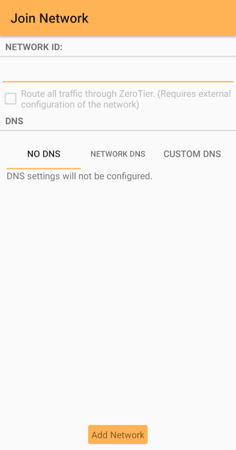

[Home](./)

# Installing ZeroTier One
ZeroTier One is the software you will use to connect to a ZeroTier network. Start by downloading and installing [ZeroTier One for your device](https://www.zerotier.com/download/).

- If greeted with a message telling you to create a network (like the one below), press `Close`

## Updating
If you already have ZeroTier installed, you can update it by downloading and installing the [latest version](https://www.zerotier.com/download/).

# Joining a Network

For your **security**, it's important that you **only join networks that you trust**.

## macOS or Windows
First, open the ZeroTier One interface:
 - On macOS, the app will be in the top menu bar with the ⏁ icon. Click on it and select `Open Control Panel...`
 - On Windows, the app is in the system tray in the bottom right corner of the screen. Right click it and select `Open Control Panel...`

Then add a network:
- At the bottom of the ZeroTier control panel, there is a box to enter your Network ID. After doing so, press `Join Network`
- Shortly after, your new network will appear in the list. You can click on it to see more details

If your network administrator has told you to allow network DNS management:
- Open the ZeroTier control panel and click on the appropriate network
- Find the option `Allow DNS Configuration` for that network and enable it

## Android or iOS
1. Press the `+` in the top corner of the main app screen
2. Enter the Network ID
3. If your network administrator has told you to adjust DNS settings, you can do so by selecting the `Network DNS` or `Custom DNS` tabs
4. Press `Add Network`
5. Make sure the switch next to the network name on the main screen is turned on

Your device may give you a notification about a VPN connection. This connection is needed to join the ZeroTier network.

### Changing Network Settings
After joining a network, you might not be able to change its settings. Instead, you must remove it and add it again. To remove it press on it and hold, then press `Delete`.

# Getting Your Connection Accepted
Your network administrator may need to accept your connection to the network. If so, they might also need your Node ID/Address. Contact them to find out.

## Finding Your Node ID/Address
### macOS or Windows
1. Open the ZeroTier control panel
2. Your ZeroTier address should be displayed on the left
3. Make note of it

### Android or iOS
Find your Node ID/Address in the status bar at the bottom of the main app screen, as shown below:

# Checking You're Connected and Reconnecting
## macOS or Windows
1. Open the ZeroTier control panel to see all the networks you've added
2. If a network has `Reconnect` and `Forget` buttons next to it, it's disconnected. Click on `Reconnect` to join it

## Android or iOS
1. Open the main screen of the ZeroTier app
2. Make sure the switch next to the network name on the main screen is turned on
3. If you have successfully connected, the message in the status bar of the app should say "Online"

The screenshot above shows the app screen with a successfully connected network.

If you are connected, your device should also indicate that you're connected to a VPN.

# Links

## Help
[ZeroTier Support Knowledge Base](https://zerotier.atlassian.net/wiki/spaces/SD/overview)

## Technical
[ZeroTier Documentation](https://docs.zerotier.com/)

